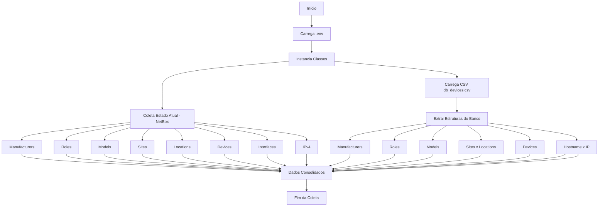
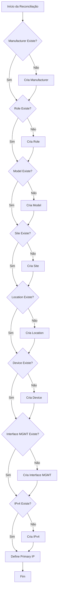

# 🚀 Sincronismo de Inventário - NetBox

> Sincronização automática entre um banco de dados CSV e o NetBox, garantindo consistência completa do inventário.


---

# 📌 Objetivo

📌 Objetivo do Projeto

Este projeto realiza a sincronização automática entre uma base CSV de dispositivos e o NetBox, garantindo que:
 - Manufacturers existam
 - Roles existam
 - Models existam
 - Sites existam
 - Locations existam
 - Devices estejam cadastrados
 - Interface de gerenciamento (mgmt) exista
 - IP de gerenciamento esteja configurado corretamente

Tudo isso é validado antes de criar qualquer coisa no NetBox.

---

# 🧠 O que ele faz?

Valida e cria automaticamente (se necessário):

 - ✅ Manufacturers
 - ✅ Device Roles
 - ✅ Device Types (Models)
 - ✅ Sites
 - ✅ Locations
 - ✅ Devices
 - ✅ Interface de gerenciamento (mgmt)
 - ✅ IPv4 de gerenciamento
 - ✅ Define IP como Primary no device

---

# 🏗️ Estrutura do Projeto
```bash
.
├── .env
├── main_netbox.py
├── Classes/
│   ├── instance.py
│   ├── get_data_netbox.py
│   └── validation.py
└── database/
    └── db_devices.csv
```
---

# 🧠 Arquitetura Geral

O fluxo é dividido em 3 grandes camadas:

| Camada                  | Arquivo                | Responsabilidade                                |
|        :---:            |        :---:           |                     :---:                      |
| 🔌 Conexão API          | `instance.py`          | Faz requisições REST para o NetBox             |
| 📊 Coleta e Tratamento  | `get_data_netbox.py`   | Lê CSV e organiza dados                        |
| ✅ Validação            | `validation.py`        | Compara CSV vs NetBox e cria o que faltar      |
| 🚀 Orquestração         | `main_netbox.py`       | Executa tudo na ordem correta                  |


---

# 🔍 Arquitetura

O projeto é dividido em 4 camadas principais:

## 🔌 1. Conexão API (`instance.py`)

Responsável por:

 - Requisições GET / POST / PATCH
 - Padronização de headers
 - Tratamento de exceções
 - Conversão do JSON da API em dicionários organizados

---

## 📊 2. Coleta de Dados (`get_data_netbox.py`)

Responsável por:

### 🔹 A) Coletar dados existentes no NetBox

 - Manufacturers
 - Roles
 - Models
 - Sites
 - Locations
 - Devices
 - Interfaces
 - IPv4

### 🔹 B) Ler e organizar o CSV
O CSV db_devices.csv é carregado com pandas.

Ele extrai:
 - Manufacturers
 - Tipos (roles)
 - Modelos
 - Sites
 - Localidades
 - Devices
 - Hostname + IP

E organiza tudo em estruturas prontas para validação.
---

## ✅ 3. Validação e Criação (`validation.py`)

Essa é a inteligência do projeto.

Fluxo hierárquico obrigatório:
 1. Manufacturers
 2. Roles
 3. Models
 4. Sites
 5. Locations
 6. Devices
 7. Interface mgmt
 8. IPv4 mgmt

Tudo é validado antes de criar.

O script é idempotente, ou seja:

    Ele não recria o que já existe.

## 🚀 4. Orquestração (`main_netbox.py`)

É o ponto de entrada.

Responsável por:
 - Carregar variáveis de ambiente
 - Instanciar classes
 - Executar validações na ordem correta

## 🔄 Fluxo de Execução
## 📊 1️⃣ Fluxo — Coleta de Informações

Mostra apenas a origem dos dados. 



---

# ⚙️ 2️⃣ Fluxo — Tratamento + Validação + Configuração

Agora sim entra a parte inteligente do projeto.
 

---
## ⚙️ Pré-requisitos
 - Python 3.9+
 - NetBox acessível via API
 - Token de API válido
 - Arquivo CSV estruturado corretamente
 
## 🔐 Variáveis de Ambiente
Criar um arquivo .env na raiz:
```bash
URL=http://localhost:8000/api/
API_TOKEN=seu_token_aqui
```

## ▶️ Execução
python main_netbox.py

## 📄 Estrutura do CSV
Formato esperado:

```bash
hostname,ip,localidade,sites,modelo,manufacturer,tipo,cor,serial_number
```
Importante que o modelo esteja arquitetado como:
 - VENDOR: Cisco
 - TIPO: Switch, Router, Access_Point: Catalyst
 - Modelo do device: 9300
                                                                                  
Exemplo:
```bash
SP-DC-SWC-01,10.0.0.1/24,DATACENTER,SP,Cisco Catalyst 9300,Cisco,Switch,#FF5733,FOC123456
```

## 🎯 Características Técnicas

 - ✔ Separação clara de responsabilidades
 - ✔ Hierarquia respeitada
 - ✔ Sincronização completa
 - ✔ Atualiza IP primário automaticamente
 - ✔ Estrutura modular
 - ✔ Fácil expansão

## 🚧 Melhorias Futuras (Roadmap)
 - Implementar paginação automática completa
 - Implementar logging estruturado
 - Criar modo Dry-Run
 - Criar validação de inconsistência (IP em device errado)
 - Implementar rollback
 - Transformar em CLI tool

## 💡 Conceito Arquitetural

Esse projeto funciona como um:

## 🔁 Motor de Reconciliação de Inventário para NetBox

Ele compara estado desejado (CSV) com estado atual (NetBox) e converge o ambiente.

## 👨‍💻 Autor
- Desenvolvido por José Osmar Caitano 
- Network Engineer | Automation | NetDevOps
